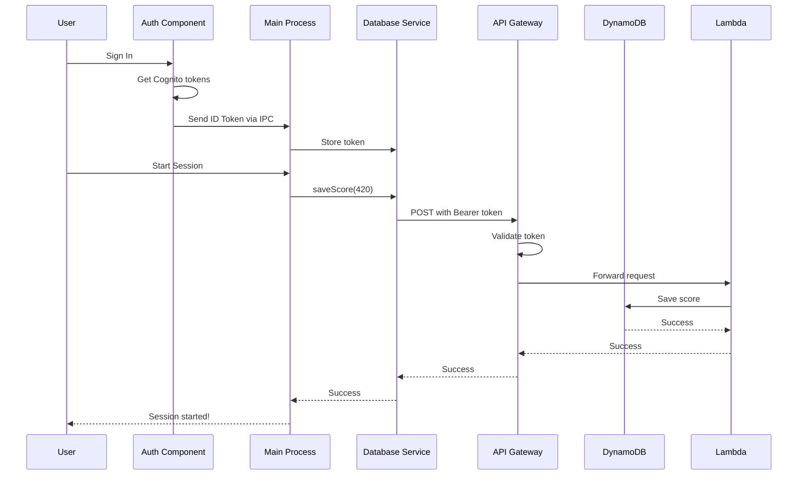

# Database Integration - Complete Guide

## 🎯 Overview

Your app now automatically saves a **dummy score of 420** to DynamoDB when you start a focus tracking session!

## ✅ What's Been Implemented

### Core Features

-   ✅ Automatic score saving when tracking starts
-   ✅ JWT token authentication with AWS Cognito
-   ✅ Database service in Electron main process
-   ✅ IPC communication between renderer and main process
-   ✅ Automatic token initialization on app startup
-   ✅ Error handling and logging throughout

### Files Structure

```
focal/
├── electron/
│   ├── main.ts                      [MODIFIED] - Added database integration
│   └── services/
│       └── database.ts              [NEW] - Database service
├── src/
│   ├── App.tsx                      [MODIFIED] - Auto-init auth on startup
│   ├── components/
│   │   └── Auth.tsx                 [MODIFIED] - Send token after sign-in
│   ├── types/
│   │   └── ipc.ts                   [MODIFIED] - Added database types
│   └── utils/
│       └── database.ts              [NEW] - Renderer database utilities
└── Documentation:
    ├── DATABASE_SETUP.md            [NEW] - Setup instructions
    ├── DATABASE_IMPLEMENTATION_SUMMARY.md [NEW] - Technical details
    ├── INTEGRATION_EXAMPLE.md       [NEW] - How to use real scores
    └── DATABASE_README.md           [NEW] - This file
```

## 🚀 Quick Start

### 1. Configure API Gateway URL

Create a `.env` file in the `focal/` directory:

```env
# API Gateway URL for database operations
API_GATEWAY_URL=https://your-api-id.execute-api.region.amazonaws.com/prod

# AWS Bedrock API Key (already configured)
BEDROCK_API_KEY=your_existing_key
```

### 2. Set Up AWS Infrastructure

You need to create:

1. **DynamoDB Table** named `user_scores` with primary key `user_id`
2. **API Gateway** with three endpoints:
    - `POST /save_score`
    - `GET /get_score`
    - `PUT /update_score`
3. **Lambda Functions** for each endpoint (code in DATABASE_SETUP.md)
4. **Cognito Authorizer** to validate JWT tokens

See **DATABASE_SETUP.md** for detailed AWS setup instructions.

### 3. Test It!

1. Start the app and sign in
2. Start a focus tracking session
3. Check the console for:
    ```
    💾 Attempting to save dummy score of 420 to database...
    ✅ Dummy score of 420 saved successfully!
    ```
4. Check your DynamoDB table to see the score!

## 🔐 How Authentication Works



## 📝 Code Flow

### When User Signs In

```typescript
// 1. Auth.tsx - Sign in successful
const response = await authService.signIn(username, password);

// 2. Extract ID token
const idToken = response.AuthenticationResult?.IdToken;

// 3. Send to main process
setAuthToken(idToken);

// 4. Main process stores token
// (electron/main.ts)
ipcMain.on("set-auth-token", (_e, token) => {
	databaseService.setAuthToken(token);
});
```

### When Tracking Starts

```typescript
// 1. User clicks "Start Session" in Dashboard
// 2. Renderer sends IPC message
ipcRenderer.send("start-session");

// 3. Main process handles it
// (electron/main.ts)
ipcMain.on("start-session", async () => {
	// Start tracking
	this.focusTracker.start();
	this.startTracking();

	// Save dummy score
	try {
		await databaseService.saveScore(420);
		console.log("✅ Dummy score of 420 saved successfully!");
	} catch (error) {
		console.error("❌ Failed to save dummy score:", error.message);
	}
});
```

## 🔧 API Methods

### Renderer Process (src/utils/database.ts)

```typescript
import { setAuthToken, fetchScore, updateScore, initializeDatabaseAuth } from "./utils/database";

// Initialize database auth (auto-called in App.tsx)
initializeDatabaseAuth();

// Fetch current score
const score = await fetchScore();
console.log("Current score:", score);

// Update score (add to existing)
const success = await updateScore(50);
if (success) {
	console.log("Score increased by 50");
}
```

### Main Process (electron/services/database.ts)

```typescript
import { databaseService } from "./services/database";

// Set auth token
databaseService.setAuthToken(token);

// Save/overwrite score
await databaseService.saveScore(420);

// Fetch current score
const score = await databaseService.fetchScore();

// Add to existing score
await databaseService.updateScore(50);
```

## 🎮 Using Real Scores

Right now it saves a dummy score of 420. To use real productivity scores:

### Option 1: Save Final Score on Session End

```typescript
// In electron/main.ts
ipcMain.on("stop-session", async () => {
	const finalScore = Math.round(this.focusAI.cumulativeScore);
	await databaseService.saveScore(finalScore);
	// ... rest of stop logic
});
```

### Option 2: Periodic Auto-Save

```typescript
// Save every 5 minutes
setInterval(async () => {
	const currentScore = Math.round(this.focusAI.cumulativeScore);
	await databaseService.saveScore(currentScore);
}, 5 * 60 * 1000);
```

See **INTEGRATION_EXAMPLE.md** for more detailed examples!

## 🐛 Troubleshooting

### "Authentication token not available"

**Problem**: Token not sent to main process  
**Solution**: Make sure you're signed in before starting a session

### "Failed to save score"

**Problem**: API Gateway or Lambda error  
**Solutions**:

-   Check API_GATEWAY_URL is correct
-   Verify Lambda functions are deployed
-   Check CORS is enabled
-   Look at CloudWatch logs

### "Network Error"

**Problem**: Can't reach API Gateway  
**Solutions**:

-   Check internet connection
-   Verify API Gateway URL is accessible
-   Check for firewall/proxy issues

### No console logs appear

**Problem**: Code not executing  
**Solutions**:

-   Open DevTools (View → Developer Tools)
-   Check for JavaScript errors
-   Verify IPC communication is working

## 📊 DynamoDB Table Structure

```json
{
	"user_id": "abc123-cognito-user-id",
	"score": 420,
	"timestamp": 1697234567890,
	"updated_at": 1697234567890
}
```

## 🔑 Environment Variables

Create a `.env` file:

```env
# Required for database operations
API_GATEWAY_URL=https://your-api.execute-api.us-east-1.amazonaws.com/prod

# Already configured
BEDROCK_API_KEY=your_bedrock_key
```

## 📚 Documentation Files

-   **DATABASE_SETUP.md** - Complete AWS setup with Lambda code
-   **DATABASE_IMPLEMENTATION_SUMMARY.md** - Technical implementation details
-   **INTEGRATION_EXAMPLE.md** - How to replace dummy score with real scores
-   **DATABASE_README.md** - This file (overview and quick start)

## ✨ Next Steps

1. **Set up AWS infrastructure** (see DATABASE_SETUP.md)
2. **Configure API_GATEWAY_URL** in .env
3. **Test with dummy score** (420)
4. **Replace with real scores** (see INTEGRATION_EXAMPLE.md)
5. **Add cool features**:
    - Score history charts
    - Leaderboards
    - Achievements
    - Cloud sync for garden
    - Push notifications for milestones

## 💡 Pro Tips

-   Use **periodic auto-save** to prevent data loss
-   Save **final score on session end** for accuracy
-   Add **error retry logic** for network issues
-   Implement **offline queue** for when internet is down
-   Use **optimistic updates** for better UX
-   Add **loading states** in the UI
-   Show **sync status** indicator
-   Implement **conflict resolution** for concurrent updates

## 🎉 Success Indicators

When everything is working, you'll see:

```
Console Logs:
-------------
🔑 Auth token sent to main process
🔑 Database auth initialized with existing session
💾 Attempting to save dummy score of 420 to database...
✅ Dummy score of 420 saved successfully!

DynamoDB Table:
--------------
user_id: "abc-123-xyz"
score: 420
timestamp: 1697234567890
updated_at: 1697234567890
```

## 🆘 Need Help?

1. Check console logs for error messages
2. Review DATABASE_SETUP.md for AWS configuration
3. Check CloudWatch logs for Lambda errors
4. Verify all environment variables are set
5. Test API Gateway endpoints with Postman
6. Check DynamoDB table exists and is accessible

## 🔒 Security Checklist

-   ✅ Using JWT tokens for authentication
-   ✅ Cognito authorizer validates all requests
-   ✅ User ID from secure token claims
-   ✅ No credentials in code
-   ⚠️ Use HTTPS for API Gateway
-   ⚠️ Don't commit .env to version control
-   ⚠️ Use minimal IAM permissions for Lambda
-   ⚠️ Enable CloudWatch logging for debugging

---

**Ready to go!** Start a focus session and watch that score of 420 get saved! 🚀
